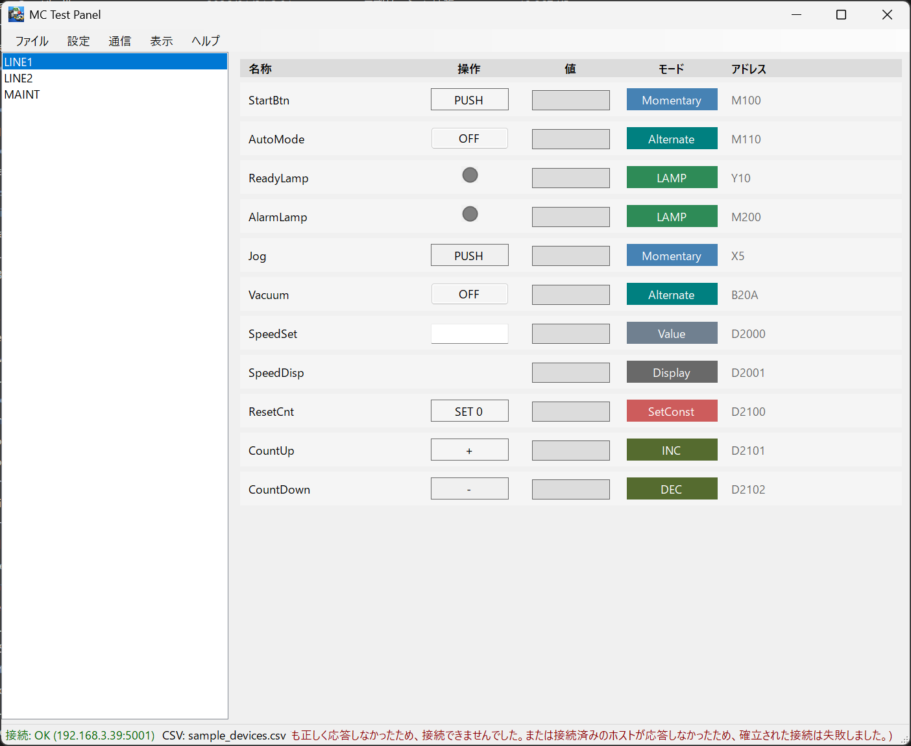

# MC Test Panel

MC Test Panel は、CSV 定義から PLC 用の簡易テストパネルを生成する Windows Forms アプリです。  
MELSEC 通信ライブラリ `McpX` を使って、Bit/Word の読み書きを行います。

**仕様**
1. CSV 定義からグループ別に画面を生成
1. Bit/Word の読み取り・書き込みに対応
1. 操作（左）/ 現在値（右）の2列レイアウト
1. 進数切替（10進 / 16進）
1. 更新周期切替（100 / 200 / 500 / 1000 ms）
1. 接続設定は `connection.csv` に保存
1. 通信ログを常時表示（コピー可、上限 5000件）

**動作環境**
1. Windows
1. .NET 8 (Windows Desktop Runtime)

**起動**
1. `McTestPanel.exe` を起動
1. 初回起動時に `devices.csv` / `connection.csv` を自動生成
1. メニューの「設定 → 接続設定 / デバイス設定」で編集

**配布URL**
`https://github.com/fa-yoshinobu/MC_Test_Panel`

**スクリーンショット**


**ビルド**
1. 通常ビルド  
`dotnet build .\MC_Test_Panel.sln -c Release`
1. 単一ファイル EXE（自己完結）  
`build_singlefile.bat`
1. 出力先  
`artifacts\publish\*.exe`

**CSV フォーマット（devices.csv）**
1. 列  
`group,name,type,mode,device,address,const,comment`
1. 必須  
`group`, `name`, `type`, `mode`, `device`, `address`
1. 任意  
`const`, `comment`

**CSV 内容の例**
```
group,name,type,mode,device,address,const,comment
LINE1,StartBtn,bit,momentary,M,100,,
LINE1,AutoMode,bit,alternate,M,110,,
LINE1,SpeedSet,word,value,D,2000,,
LINE1,ResetCnt,word,setconst,D,2100,0,Reset counter
```

**Type と Mode**
1. `bit`  
`momentary`, `alternate`, `lamp`
1. `word`  
`value`, `setconst`, `inc`, `dec`, `display`

**`const` の扱い**
1. `setconst` の固定書き込み値として使用
1. 10進 (`10`) / 16進 (`0x0A` または `0A`) に対応

**device（対応一覧）**
`B, CC, CN, CS, D, DX, DY, F, L, M, R, S, SB, SC, SD, SM, SN, SS, SW, TC, TN, TS, V, W, X, Y, Z, ZR`

**address 形式**
1. 10進: `0`, `10`, `100` など
1. 16進: `A`, `1F`, `20A` など（`0x` も可）
1. 16進扱い: `X, Y, B, W, SB, SW, DX, DY`

**接続設定（connection.csv）**
```
ip,192.168.3.39
port,5001
usePassword,false
password,
isAscii,false
isUdp,True
requestFrame,E4
timeoutMs,1000
alwaysOnTop,True
```

**自動生成**
1. `devices.csv` / `connection.csv` が無い場合に自動生成
1. 生成先は実行ファイルのフォルダ

**サンプル**
1. ルート直下に `sample_devices.csv` を配置

**備考**
1. CSV はメニューの「デバイス設定」から編集可能
1. 読取エラーが連続すると自動停止し、3秒後に再接続します

**ライセンス**
1. アプリ本体: MIT License
1. McpX: MIT License
```
https://github.com/YudaiKitamura/McpX
```
